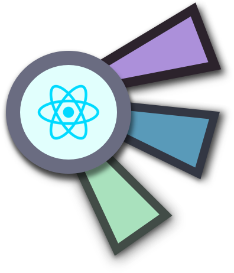

<h1 align='center'>
    <br>
    Decent React Boiler Plate
</h1>

[](https://travis-ci.org/npm/npm) [](https://www.npmjs.com/package/npm) [](http://makeapullrequest.com) [](https://github.com/your/your-project/blob/master/LICENSE)

> A basic, un-opiniated and decent boiler plate to start your project.

## Installing / Getting started

A quick introduction of the minimal setup you need to get up and running.

```
npm run dev //for development
npm run prod //to generate files for production
```
